Voici un TOS sur le démarrage de Blue Print dans Azure ! 

# Création d'un Blue Print

Dans la ressource Azure Blue print : 

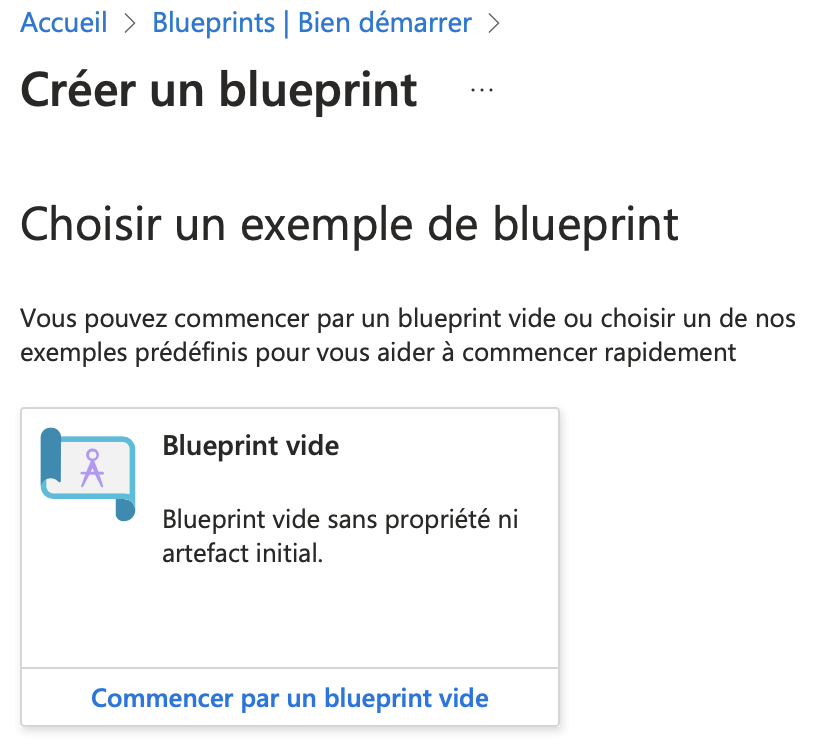

Création d'un blue print vide. 

Ajout d'un nom, d'une description, de l'abonnement Azure : 

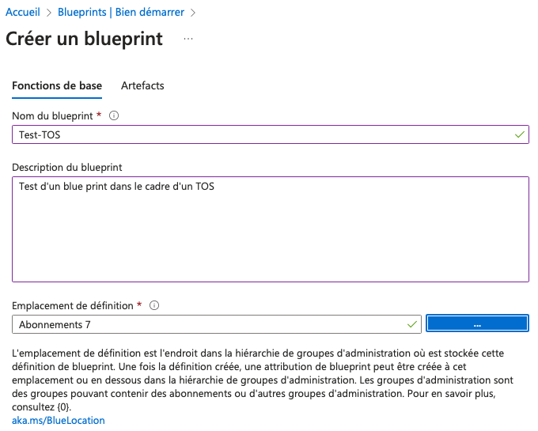

Puis nous pouvons sélectionner un artefact comme par exemple, l'ajout d'un groupe de ressources : 

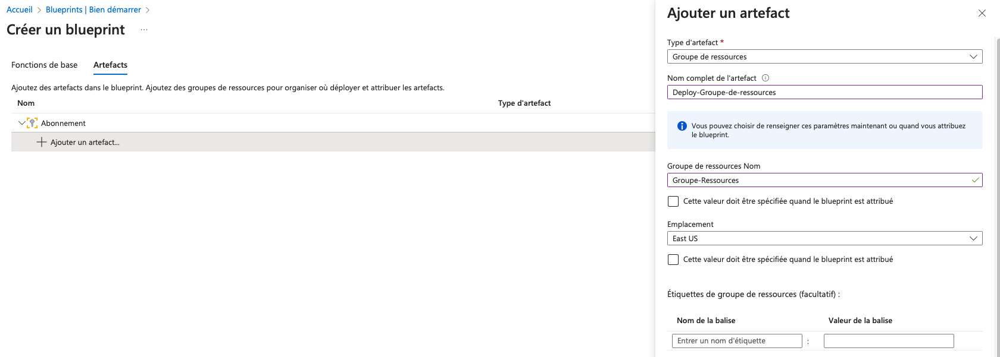

Puis nous ajoutons un deuxiéme artefact de type ARM afin de déployer un VNET (Fichier ARM dispo dans le GIT) : 

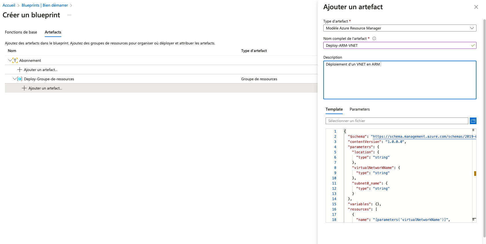

Il est important de spécifier les parametres : 

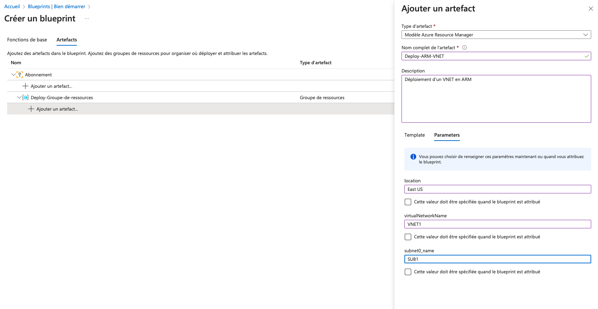

Nous pouvons enregistrer le brouillon. 

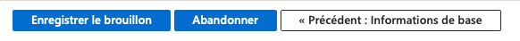

Nous publions le Blue Print : 

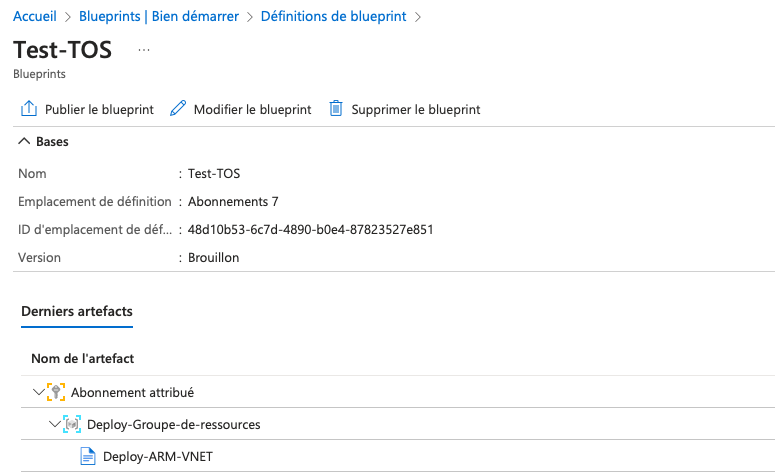

Ajout d'un numéro de version : 

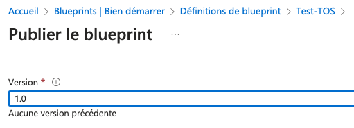

Affectation du Blue Print : 

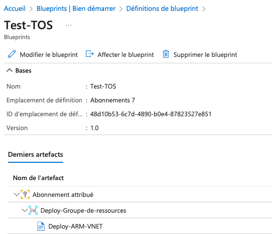

Nous devons remplir le nom de l'affectation : 

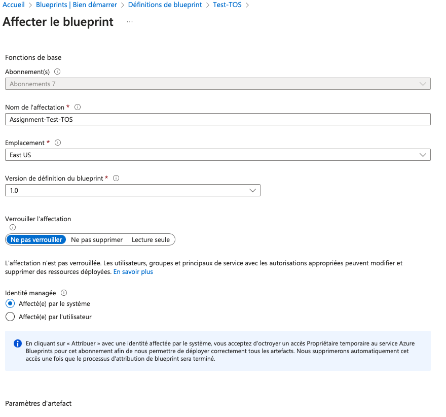

Le Blue Print est en cours de déploiement : 

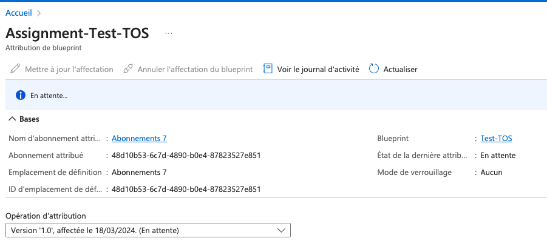

Ensuite dans la section Azure "Groupe de ressources", vous devez trouver votre groupe de ressources avec le VNET disponible. En cas de non déploiement, une erreur sera affiché avec la problématique rencontrée. 